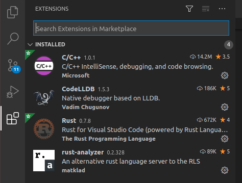
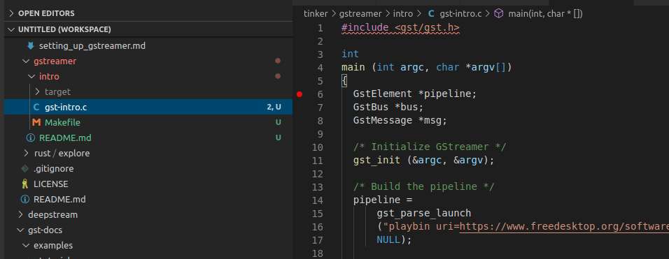
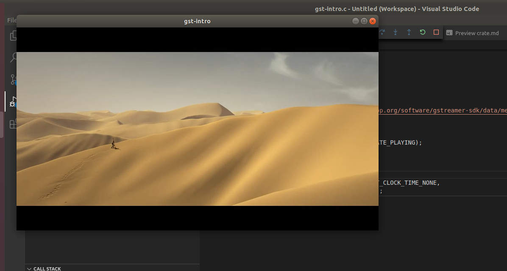

# Creating a Basic Pipeline in C

These are my note regarding learning gstreamer. First I will be doing this in 
C then trying something through Rust. 

# Table Of Content

- [Build System](#build-system)
    - [Setting Up VS Code](#setting-up-vs-Code)
        - [Hello World](#hello-world)
- [GStreamer Foundations](#gstreamer-foundations)
  - [Cleanup](#cleanup)
  - [Factories](#factories)
- [Examples](examples)


I am following the [GStreamer tutorial](https://gstreamer.freedesktop.org/documentation/tutorials/index.html)

The [gstreamer/intro](gstreamer/intro) contains sort of an incremental trial based on those tutorials. 

You get get the source code for the tutorials at [git clone https://gitlab.freedesktop.org/gstreamer/gst-docs](https://gitlab.freedesktop.org/gstreamer/gst-docs).


Right now the build stuff is using [gstreamer/intro/Makefile](gstreamer/intro/Makefile). Goto to that directory and type 
``make``. 

More on this can be found in the [official GStreamer documentation](https://gstreamer.freedesktop.org/documentation/installing/on-linux.html) 

## Build System

We should eventually consider using "build system". We could either go with [CMake](https://cmake.org/cmake/help/latest/guide/tutorial/index.html) or [meson](https://mesonbuild.com/). [Here is a comparaison](https://carlosvin.github.io/posts/choosing-modern-cpp-stack/en/).

It is worth mentioning that [GStreamer uses Meson]()


## Setting Up VS Code

First install the C++ Plugin from the MarketPlace 



As we want to debug and build from VS Code we want to setup the environment correctly so we can 
trace through the code (and forgive me my C is beyong rusty)

Install the toolchain

```
$ sudo apt-get install build-essential gdb pkg-config
```

Then I added a task in [.vscode/tasks.json](../.vscode/tasks.json) and a launcher based on [this article](https://code.visualstudio.com/docs/cpp/config-linux). Nothing fancy. 

### Hello World

This is a simple example. However the same process should apply to all the other "mini" projects.

To run the command from the command line

```shell
$ cd gstreamer/intro
$ make run
```

To build and debug, do the following

- select the file (e.g. [gstreamer/intro/gst-intro.c](../gstreamer/intro/gst-intro.c)) and open it as illustrated below
  
- set a break point
- click on the "debug/Play" Icon on the left handside bar (just above marketplace) and select the
  ``gstreamer build and debug active file`` from the drop down. This will automatically build the file in 
  debug and then launch the debugger and stop on the breakpoint.
  
  
if you run this example you should get something like this



# GStreamer Foundations

The following is taken from [GStreamer Foundations](https://gstreamer.freedesktop.org/documentation/application-development/introduction/basics.html?gi-language=c#)

But in an nutshell, there are 2 fundamental construct in GStreamer; **Elements** and **Pads**. **Elements** are responsible for processing 
data and **Pads** provide the data connections between **Elements**. **Pads** can either be *sink* or *source*. Those connections are negotiated through *Capacities* (GstCaps)

There are three types of **Elements**:

  - **Sources** - this is where the data originate from (e.g. file)
  - **Filters** - data processing elements such as demuxer, decoders, etc
  - **Sink** - this is where the transformed data ends up (display, streaming, etc)


**Bins** are containers of **Elements** and are **Elements** themselves, being subclasses of **Elements**. The purpose of **Bins** is 
to abstract behavior that can not be implemented as a single **Element**. For example, an encoder may consist of multiple **Elements**
(pre-processing, encoding, quantization, rate control) but should be percieved as a single **Element** in the pipeline. A great example 
of this in GStreamer is [playbin](https://gstreamer.freedesktop.org/documentation/playback/playbin.html)

**Pipelines** are top level **Bins**.

Finally, GStreamer offers 4 communication mechanism: *Buffers*, *Events*, *Messages* and *Queries*. You can read the details on the 
link aforementioned (as the purpose here is not to repeat what is already documented), but those should be pretty straight forward
for the picture blow


Those communication mechanism are carried through a **Bus** as illustrated above. **BUS**ses are built-in automatically as part of the pipeline. 

You can either poll the **BUS** or install a watch (a.k.a. callback). In the later, the callback will be called whenever a messages is posted. A third option (``gst_bus_timed_pop_filtered()``) is like a wait on multiple,
where you can specify multiple message types and block until one those appear on the **BUS**. 

```C
// This call will block until the end of the playback is reached 
// or an error occurs.
  msg =
      gst_bus_timed_pop_filtered (bus, GST_CLOCK_TIME_NONE,
      GST_MESSAGE_ERROR | GST_MESSAGE_EOS);

```

- [More on Element](https://gstreamer.freedesktop.org/documentation/application-development/basics/elements.html)
- [More on Pads and Capabilities](https://gstreamer.freedesktop.org/documentation/application-development/basics/pads.html)
- [More on Bins](https://gstreamer.freedesktop.org/documentation/application-development/basics/bins.html)
- [More on Bus](https://gstreamer.freedesktop.org/documentation/application-development/basics/bus.html)

## Cleanup

GStreamer is based in glib's GObject. This library maintains reference 
count on objects and their memory is released when the reference count 
is 0. This required reading the documentation and understand if the
objects returned by some functions need to be released. For instance, 
the ``msg`` obtained from the **BUS** access must be released.

## Factories

GStreamer Elements are built by factories (you do not instance
them directly) as shown below

```C
  // Create a video test source (color bars)
  source = gst_element_factory_make ("videotestsrc", "source");
  sink = gst_element_factory_make ("autovideosink", "sink");
```
When the object is created, it is not configured which is unlike 
most object oriented languages. 

Congiguration is done via the ``g_object_set()`` (this is glib specific, not gstreamer)

```C
  g_object_set (source, "pattern", 0, NULL);
```

``g_object_set()`` accepts a NULL-terminated list of property-name, property-value pairs, so multiple properties can be changed in one go.

In this case, connecting the source to the sink would produce


For the actual tutorial explanation check [tutorial 2](https://gstreamer.freedesktop.org/documentation/tutorials/basic/concepts.html#)

This example is particularily interesting because it shows how the 
connection negotiation takes place. 

```C 
  gst_bin_add_many (GST_BIN (pipeline), source, sink, NULL);
  if (gst_element_link (source, sink) != TRUE) {
    g_printerr ("Elements could not be linked.\n");
    gst_object_unref (pipeline);
    return -1;
  }
```
You first add elements to the pipeline, and then explicitly attempt
to connect them one to another via ``gst_element_link()``

# Examples

To be started.