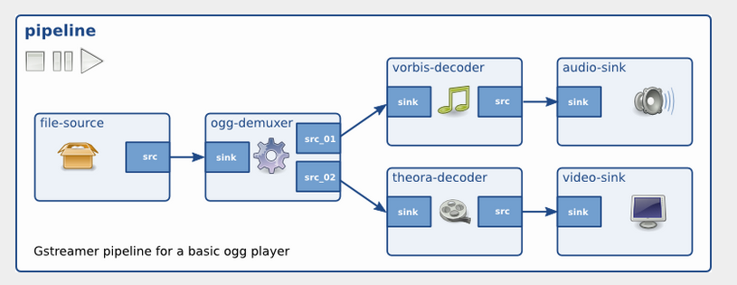
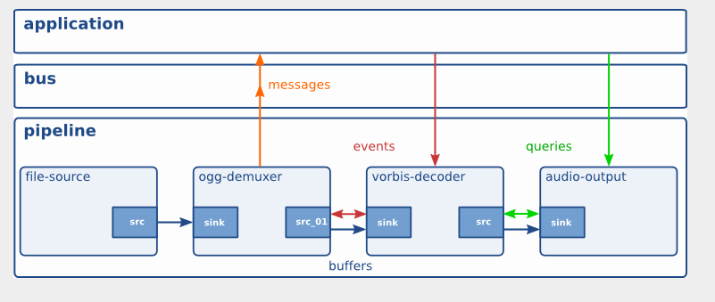
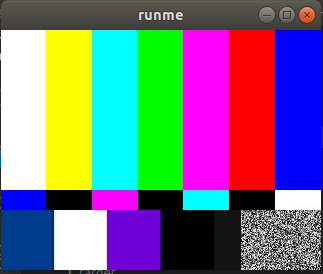

# Creating a Basic Pipeline in C

These are my note regarding learning gstreamer. First I will be doing this in 
C then trying something through Rust. 

# Table Of Content

- [Build System](#build-system)
- [GStreamer Foundations](#gstreamer-foundations)
  - [Cleanup](#cleanup)
  - [Factories](#factories)
  - [Dynamic Pipelining](#dynamic-pipelining)
  - [gst-inspect](gst-inspect)
- [Examples](examples)

---
REFERENCE

- check [vscode c++ setup](procedures/5_vscode/c++-setup.md) to learn how to configure VS Code
- Check [gstreamer installation](procedures/3_gstreamer/installation.md) for 
  additional configuration steps.
---


I am following the [GStreamer tutorial](https://gstreamer.freedesktop.org/documentation/tutorials/index.html)

The [gstreamer/intro](gstreamer/intro) contains sort of an incremental trial based on those tutorials. 

You get get the source code for the tutorials at [git clone https://gitlab.freedesktop.org/gstreamer/gst-docs](https://gitlab.freedesktop.org/gstreamer/gst-docs).


Right now the build stuff is using [gstreamer/intro/Makefile](gstreamer/intro/Makefile). Goto to that directory and type 
``make``. 

More on this can be found in the [official GStreamer documentation](https://gstreamer.freedesktop.org/documentation/installing/on-linux.html) 

## Build System

We should eventually consider using "build system". We could either go with [CMake](https://cmake.org/cmake/help/latest/guide/tutorial/index.html) or [meson](https://mesonbuild.com/). [Here is a comparaison](https://carlosvin.github.io/posts/choosing-modern-cpp-stack/en/).

It is worth mentioning that [GStreamer uses Meson]()


# GStreamer Foundations

The following is taken from [GStreamer Foundations](https://gstreamer.freedesktop.org/documentation/application-development/introduction/basics.html?gi-language=c#)

Check the [Gstreamer Lib Documentation] for function or structure documentation.

But in an nutshell, there are 2 fundamental construct in GStreamer; **[Element]s** and **Pads**. **[Element]s** are responsible for processing 
data and **Pads** provide the data connections between **[Element]s**. **Pads** can either be *sink* or *source*. Those connections are negotiated through *Capacities* (GstCaps)

There are three types of **[Element]s**:

  - **Sources** - this is where the data originate from (e.g. file)
  - **Filters** - data processing elements such as demuxer, decoders, etc
  - **Sink** - this is where the transformed data ends up (display, streaming, etc)



**Bins** are containers of **[Element]s** and are **[Element]s** themselves, being subclasses of **[Element]s**. The purpose of **Bins** is 
to abstract behavior that can not be implemented as a single **[Element]**. For example, an encoder may consist of multiple **[Element]s**
(pre-processing, encoding, quantization, rate control) but should be percieved as a single **[Element]** in the pipeline. A great example 
of this in GStreamer is [playbin](https://gstreamer.freedesktop.org/documentation/playback/playbin.html)

**[Pipeline]s** are top level **Bins**.

Finally, GStreamer offers 4 communication mechanism: *Buffers*, *Events*, *Messages* and *Queries*. You can read the details on the 
link aforementioned (as the purpose here is not to repeat what is already documented), but those should be pretty straight forward
for the picture blow



Those communication mechanism are carried through a **[Bus]** as illustrated above. [Bus]ses are built-in automatically as part of the pipeline. 

You can either poll the **[Bus]** or install a watch (a.k.a. callback). In the later, the callback will be called whenever a messages is posted. A third option (``gst_bus_timed_pop_filtered()``) is like a wait on multiple,
where you can specify multiple message types and block until one those appear on the **[Bus]**. 

```C
// This call will block until the end of the playback is reached 
// or an error occurs.
  msg =
      gst_bus_timed_pop_filtered (bus, GST_CLOCK_TIME_NONE,
      GST_MESSAGE_ERROR | GST_MESSAGE_EOS);

```

- [More on Element](https://gstreamer.freedesktop.org/documentation/application-development/basics/elements.html)
- [More on Pads and Capabilities](https://gstreamer.freedesktop.org/documentation/application-development/basics/pads.html)
- [More on Bins](https://gstreamer.freedesktop.org/documentation/application-development/basics/bins.html)
- [More on Bus](https://gstreamer.freedesktop.org/documentation/application-development/basics/bus.html)

## Cleanup

GStreamer is based in glib's GObject. This library maintains reference 
count on objects and their memory is released when the reference count 
is 0. This required reading the documentation and understand if the
objects returned by some functions need to be released. For instance, 
the ``msg`` obtained from the **[Bus]** access must be released.

## Factories

GStreamer [Element]s are built by factories (you do not instance
them directly) as shown below

```C
  // Create a video test source (color bars)
  source = gst_element_factory_make ("videotestsrc", "source");
  sink = gst_element_factory_make ("autovideosink", "sink");
```
When the object is created, it is not configured which is unlike 
most object oriented languages. 

Congiguration is done via the ``g_object_set()`` (this is glib specific, not gstreamer)

```C
  g_object_set (source, "pattern", 0, NULL);
```

``g_object_set()`` accepts a NULL-terminated list of property-name, property-value pairs, so multiple properties can be changed in one go.

In this case, connecting the source to the sink would produce



For the actual tutorial explanation check [tutorial 2](https://gstreamer.freedesktop.org/documentation/tutorials/basic/concepts.html#)

This example is particularily interesting because it shows how the 
connection negotiation takes place. 

```C 
  gst_bin_add_many (GST_BIN (pipeline), source, sink, NULL);
  if (gst_element_link (source, sink) != TRUE) {
    g_printerr ("Elements could not be linked.\n");
    gst_object_unref (pipeline);
    return -1;
  }
```
You first add elements to the pipeline, and then explicitly attempt
to connect them one to another via ``gst_element_link()``

## Dynamic Pipelining 

This is the topic of [tutorial 3](https://gstreamer.freedesktop.org/documentation/tutorials/basic/dynamic-pipelines.html)
This shows how you can alter the structure of a pipeline based on messages, configured through Dynamic 
[Pads].

The idea is the following. You create a pipeline, add all the Elements to the pipeline, then add a signal handler
on the source element and finally start the pipeline. 

```C
  /* Connect to the pad-added signal */
  g_signal_connect (data.source, "pad-added", G_CALLBACK (pad_added_handler), &data);
  /* Start playing */
  ret = gst_element_set_state (data.pipeline, GST_STATE_PLAYING);  
```

The source opens the URI, demux the content and dynamically adds as many [Pad]s as it matches elementary 
streams - iin this case, the pad_handler, ckeck the pad pad type and may decide to ignore it or process
it. This is illustrated below

```C
  if (!g_str_has_prefix (new_pad_type, "audio/x-raw")) {
    g_print ("It has type '%s' which is not raw audio. Ignoring.\n", new_pad_type);
    goto exit;
  }

  /* Attempt the link */
  ret = gst_pad_link (new_pad, sink_pad);
  if (GST_PAD_LINK_FAILED (ret)) {
    g_print ("Type is '%s' but link failed.\n", new_pad_type);
  } else {
    g_print ("Link succeeded (type '%s').\n", new_pad_type);
  }

```
which produces the following

```text
Pipeline state changed from NULL to READY:
Received new pad 'src_0' from 'source':
It has type 'video/x-raw' which is not raw audio. Ignoring.
Received new pad 'src_1' from 'source':
Link succeeded (type 'audio/x-raw').
```

If you run the ``gst-inspect-1.0 uridecodebin`` command, You will see the capacities advertised

```shell
caps                : The caps on which to stop decoding. (NULL = default)
                        flags: readable, writable
                                                   video/x-raw(ANY)
                                                   audio/x-raw(ANY)
                                                   text/x-raw(ANY)
                                                   subpicture/x-dvd
                                                   subpicture/x-dvb
                                                   subpicture/x-xsub
                                                   subpicture/x-pgs

```

as well as the signals that this plugin can emit

```shell
Element Signals:
  "pad-added" :  void user_function (GstElement* object,
                                     GstPad* arg0,
                                     gpointer user_data);
  "pad-removed" :  void user_function (GstElement* object,
                                       GstPad* arg0,
                                       gpointer user_data);
  "no-more-pads" :  void user_function (GstElement* object,
                                        gpointer user_data);

````

Finally note that the function associated to the pad above shows the signature of the 
callback function expected, in this case

```C
/* This function will be called by the pad-added signal */
static void pad_added_handler (GstElement *src, GstPad *new_pad, CustomData *data) {
  GstPad *sink_pad = gst_element_get_static_pad (data->convert, "sink");
  GstPadLinkReturn ret;
  GstCaps *new_pad_caps = NULL;
  GstStructure *new_pad_struct = NULL;
  const gchar *new_pad_type = NULL;
```

# Examples

## RTSP Pipeline

This application creates a gstreamer pipeline using either the camera as the source 
or a video file. The data should be decoded (in the case of a file),
then encoded and sent over RTSP. 

Options:

  - --loop if set, loop over the video source (if applicable)
  - --time if set, run for the specified amount of time
  - --frames if set, run and process the specified amount of frames, then exit
  - --capture-file if specified, the encoded video should be stored on the specified file.
  - --source-file if specified, the source is set to the specified file. Otherwise defailt 

During this process:

- The number of frames processed should be printed.
- If a video file input, the content is is demuxed and processed
 

Don't forget to refer to the [Gstreamer Lib Documentation]


[Gstreamer Lib Documentation]: https://gstreamer.freedesktop.org/documentation/libs.html
[Bus]: https://gstreamer.freedesktop.org/documentation/gstreamer/gstbus.html?gi-language=c#GstBus
[Element]: https://gstreamer.freedesktop.org/documentation/gstreamer/gstelement.html?gi-language=c#GstElement
[Pipeline]: https://gstreamer.freedesktop.org/documentation/gstreamer/gstpipeline.html?gi-language=c#GstPipeline
[Pads]: https://gstreamer.freedesktop.org/documentation/gstreamer/gstpad.html?gi-language=c#GstPad