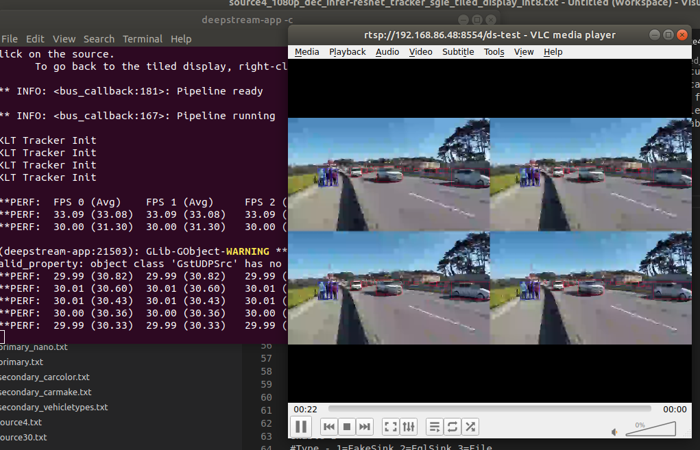

---
testspace:
---

# NVidia Configuration

Installing the NVidia tools for Deepstream for Discrete GPU is based on this 
[article](https://docs.nvidia.com/metropolis/deepstream/dev-guide/index.html#page/DeepStream_Development_Guide/deepstream_quick_start.html#wwpID0E0VF0HA)

It is very important to follow those instructions very precisely. In order for Deeptstream 5.0
to work, the following needs to be installed:

- [NVidia GFX Driver](#graphic-driver) **450.51**
- [Cuda](#cuda-102) **10.2**
- [TensorRT](#install-tensorrt-70) **7.0**
- [Install libkafta](#install-libkafta)
- [Install the GStreamer Libraries](#install-the-gstreamer-libraries)
- [DeepStream SDK 5.0](#deepstream-sdk-5.0)
- [DeepStream Test](#deepstream-test)


## Graphic Driver

It is important that no NVidia driver is installed. Otherwise you will get 
a warning and you will be required to go in recovery mode, uninstall the 
driver and install the new driver. 

* [download the driver 450.51](https://www.nvidia.com/Download/driverResults.aspx/160555/en-us)

* run the command 
    ```shell
    $ chmod 755 NVIDIA-Linux-x86_64-450.51.run
    $ ./NVIDIA-Linux-x86_64-450.51.run
    ```
    You will get an error like "preinstall failed", **just ignore** and move along. 
    It is a BS script that returns 1 to scare people. 

* check the driver version
    ```
    $ modinfo nvidia
    filename:       /lib/modules/5.4.0-48-generic/updates/dkms/nvidia.ko
    version:        450.51

    nvidia-smi
    Fri Oct  2 17:34:17 2020       
    +-----------------------------------------------------------------------------+
    | NVIDIA-SMI 450.51       Driver Version: 450.51       CUDA Version: 11.0     |
    |-------------------------------+----------------------+----------------------+
    | GPU  Name        Persistence-M| Bus-Id        Disp.A | Volatile Uncorr. ECC |
    | Fan  Temp  Perf  Pwr:Usage/Cap|         Memory-Usage | GPU-Util  Compute M. |
    |                               |                      |               MIG M. |
    |===============================+======================+======================|
    |   0  GeForce RTX 2070    Off  | 00000000:01:00.0  On |                  N/A |
    | N/A   48C    P0    25W /  N/A |    476MiB /  7979MiB |      6%      Default |
    |                               |                      |                  N/A |
    +-------------------------------+----------------------+----------------------+
                                                                                
    +-----------------------------------------------------------------------------+
    | Processes:                                                                  |
    |  GPU   GI   CI        PID   Type   Process name                  GPU Memory |
    |        ID   ID                                                   Usage      |
    |=============================================================================|
    |    0   N/A  N/A      1027      G   /usr/lib/xorg/Xorg                 18MiB |
    |    0   N/A  N/A      1212      G   /usr/bin/gnome-shell               50MiB |
    |    0   N/A  N/A      1417      G   /usr/lib/xorg/Xorg                256MiB |
    |    0   N/A  N/A      1558      G   /usr/bin/gnome-shell              131MiB |
    |    0   N/A  N/A      1944      G   gnome-control-center               12MiB |
    |    0   N/A  N/A      2922      G   /usr/lib/firefox/firefox            2MiB |
    +-----------------------------------------------------------------------------+

    ```

    Now I know it shows Cuda version 11.0 but don't pay attention to this

## Cuda 10.2

* Remove any Cuda stuff
    ```
    sudo apt autoremove --purge 'cuda*
    ```
* Pull Version 10.2
    ```
    wget https://developer.download.nvidia.com/compute/cuda/repos/ubuntu1804/x86_64/cuda-ubuntu1804.pinsudo 
    mv cuda-ubuntu1804.pin /etc/apt/preferences.d/cuda-repository-pin-600
    wget http://developer.download.nvidia.com/compute/cuda/10.2/Prod/local_installers/cuda-repo-ubuntu1804-10-2-local-10.2.89-440.33.01_1.0-1_amd64.deb
    sudo dpkg -i cuda-repo-ubuntu1804-10-2-local-10.2.89-440.33.01_1.0-1_amd64.deb
    sudo apt-key add /var/cuda-repo-10-2-local-10.2.89-440.33.01/7fa2af80.pub
    sudo apt-get update
    sudo apt-get install cuda-10.2
    ```

* check the cuda version you have. Make sure it is **10.2** - Also note that the CUDA version is now 10.2 and not 11.0
    ``` shell
    $ nvcc --version
    nvcc: NVIDIA (R) Cuda compiler driver
    Copyright (c) 2005-2019 NVIDIA Corporation
    Built on Wed_Oct_23_19:24:38_PDT_2019
    Cuda compilation tools, release 10.2, V10.2.89
    $ nvidia-smi     
    Fri Oct  2 17:49:58 2020       
    +-----------------------------------------------------------------------------+
    | NVIDIA-SMI 440.33.01    Driver Version: 440.33.01    CUDA Version: 10.2     |
    |-------------------------------+----------------------+----------------------+
    | GPU  Name        Persistence-M| Bus-Id        Disp.A | Volatile Uncorr. ECC |
    | Fan  Temp  Perf  Pwr:Usage/Cap|         Memory-Usage | GPU-Util  Compute M. |
    |===============================+======================+======================|
    |   0  Graphics Device     On   | 00000000:01:00.0  On |                  N/A |
    | N/A   48C    P0    26W /  N/A |    495MiB /  7979MiB |      0%      Default |
    +-------------------------------+----------------------+----------------------+
                                                                                
    +-----------------------------------------------------------------------------+
    | Processes:                                                       GPU Memory |
    |  GPU       PID   Type   Process name                             Usage      |
    |=============================================================================|
    |    0      1078      G   /usr/lib/xorg/Xorg                            34MiB |
    |    0      1123      G   /usr/bin/gnome-shell                          49MiB |
    |    0      1448      G   /usr/lib/xorg/Xorg                           278MiB |
    |    0      1593      G   /usr/bin/gnome-shell                         129MiB |
    +-----------------------------------------------------------------------------+

    ```

## Install TensorRT 7.0

* Download the Debian package for [TensorRT7.0](https://developer.nvidia.com/nvidia-tensorrt-7x-download).
    You will need to login with you nvidia credentials. Make sure it is 7.0. not 7.1 or 7.2
    ```shell
    $ cd nvidia 
    $ sudo dpkg -i ./nv-tensorrt-repo-ubuntu1804-cuda10.2-trt7.0.0.11-ga-20191216_1-1_amd64.deb 
    ...
    $ sudo apt-key add /var/nv-tensorrt-repo-cuda10.2-trt7.0.0.11-ga-20191216/7fa2af80.pub 
    OK
    $ sudo apt-get update
    $ sudo apt-get install tensorrt
    ```

* Check that it is indeed 7.0 on 10.2
    ```
    $ dpkg -l | grep tensorrt
    ii  tensorrt      7.0.0.11-1+cuda10.2                              amd64        Meta package of TensorRT
    ```
* Install additional converter
    ```
    $ sudo apt-get install uff-converter-tf
    ```

## Install libkafta

This [libkafta](https://github.com/edenhill/librdkafka) is used for high performance message delivery. 
This is used to connect DeepStream to backend NVidia servers.

* Checkout this repos in a temp location
    ```
    $ git clone https://github.com/edenhill/librdkafka.git
    $ cd librdkafka
    $ git reset --hard 7101c2310341ab3f4675fc565f64f0967e135a6a
    $ ./configure
    $ make
    $ sudo make install
    ```

## Install the GStreamer Libraries

* Install the gstreamer libraries

```
sudo apt-get install libssl1.1 libgstreamer1.0-0 gstreamer1.0-plugins-good gstreamer1.0-plugins-bad gstreamer1.0-tools gstreamer1.0-plugins-ugly gstreamer1.0-libav libgstrtspserver-1.0-0 libjansson4 pkg-config libegl1 libglvnd-dev

```


## DeepStream SDK 5.0

* Download the debian package. You will need to login to the developer area
* Then run the installation
    ```shell
    $ sudo apt-get install ./deepstream_sdk_5.0_amd64.deb
    ```

## DeepStream Test

This is a simple test to make sure that DeepStream is installed properly

```shell
deepstream-app -c /opt/nvidia/deepstream/deepstream-5.0/samples/configs/deepstream-app/source4_1080p_dec_infer-resnet_tracker_sgie_tiled_display_int8.txt
```

It is however possible that you see a problem where it starts with a blank display, 
so you take you computer and you throw it out the f**** window.

So here is the story - For some reason gstreamer can't connect to the display via the DRI
```
libEGL warning: DRI2: failed to authenticate
```

This is normally good enough, but if you want to see the output, you can use VLC as an RTSP
client and connect to ``rtsp://localhost:8554/ds-test``

Edit the ``/opt/nvidia/deepstream/deepstream-5.0/samples/configs/deepstream-app/source4_1080p_dec_infer-resnet_tracker_sgie_tiled_display_int8.txt`` config file and set the type 
to RTSP streaming (4) 
```ini
[sink2]
enable=1
#Type - 1=FakeSink 2=EglSink 3=File 4=RTSPStreaming
type=4
#1=h264 2=h265
codec=1
#encoder type 0=Hardware 1=Software
enc-type=0
sync=0
#iframeinterval=10
bitrate=400000
#H264 Profile - 0=Baseline 2=Main 4=High
#H265 Profile - 0=Main 1=Main10
profile=0
# set below properties in case of RTSPStreaming
rtsp-port=8554
udp-port=5400
```

and you should see

