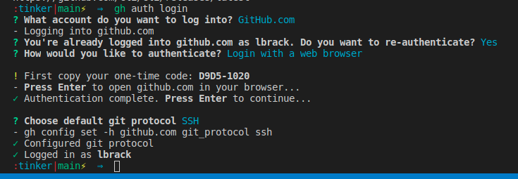
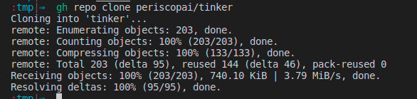

---
testspace:
---
# Github Setup


## Install the gitgub CLI

The [github cli](https://cli.github.com/) inufies the github
workflow with the command line, thus avoiding us from 
switching between command line and a web browser. 

Copy the following to a terminal. 

```shell
sudo apt-key adv --keyserver keyserver.ubuntu.com --recv-key C99B11DEB97541F0
sudo apt-add-repository https://cli.github.com/packages
sudo apt update
sudo apt install gh
```

* check the installation
    ```
    gh --version                         
    gh version 1.1.0 (2020-10-06)
    https://github.com/cli/cli/releases/latest
    ```
* Authenticate with the server as shown below
  

## Clone the Thinker Repository

This will clone the [tinker repos]itory onto your machine.

- [gh repo clone] periscopai/tinker 
    


[tinker repos]: https://github.com/periscopai/tinker 
[gh manual]: https://cli.github.com/manual/
[gh repo clone]: https://cli.github.com/manual/gh_repo_clone

## Create a Merge Request

Once you have some commits on a branch, you can create a merge request 
from the command line.

```shell
gh pr create
```