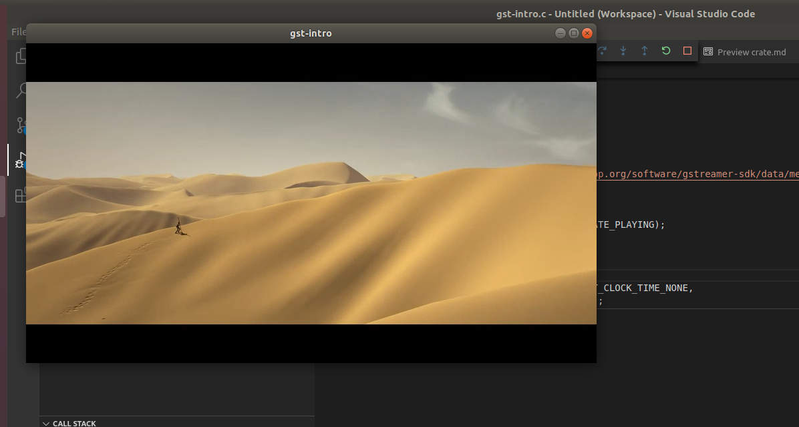

---
testspace:
---
# Gstreamer Installation

This spec goes through the processing of installing gstreamer and configuring VS Code. This is based on Ubuntu 1804

## Installing Build Dependencies

Verify thay the build requirements are installed 

run
```shell
 sudo apt-get install build-essential gdb pkg-config
```

* type ``gcc --version`` - should be 
    ```
    gcc --version
    gcc (Ubuntu 7.5.0-3ubuntu1~18.04) 7.5.0
    Copyright (C) 2017 Free Software Foundation, Inc.
    This is free software; see the source for copying conditions.  There is NO
    warranty; not even for MERCHANTABILITY or FITNESS FOR A PARTICULAR PURPOSE.
    ```
* type ``make --version``
    ```
    make --version
    GNU Make 4.1
    Built for x86_64-pc-linux-gnu
    Copyright (C) 1988-2014 Free Software Foundation, Inc.
    License GPLv3+: GNU GPL version 3 or later <http://gnu.org/licenses/gpl.html>
    This is free software: you are free to change and redistribute it.
    There is NO WARRANTY, to the extent permitted by law.
    ```


## Installing GStreamer Requirements

GStreamers requires a list of libraries including the core 

run the following command

```shell
sudo apt-get install libgstreamer1.0-0 gstreamer1.0-plugins-base gstreamer1.0-plugins-good gstreamer1.0-plugins-bad gstreamer1.0-plugins-ugly gstreamer1.0-libav gstreamer1.0-doc gstreamer1.0-tools gstreamer1.0-x gstreamer1.0-alsa gstreamer1.0-gl gstreamer1.0-gtk3 gstreamer1.0-qt5 gstreamer1.0-pulseaudio
```

* run ``gst-inspect-1.0`` and you should see over 200 plugins 
    ```shell
    ...
    debug:  rndbuffersize: Random buffer size
    debug:  capssetter: CapsSetter
    debug:  breakmydata: Break my data
    staticelements:  bin: Generic bin
    staticelements:  pipeline: Pipeline object

    Total count: 263 plugins (1 blacklist entry not shown), 1417 features    
    ```

* cd to [gstreamer/intro](../../gstreamer/intro)
* type ``make run``
  you should see the following 
  ```shell
        make run      
        mkdir -p target/rls
        type make debug=true to build in debug mode
        gcc  gst-intro.c -o target/rls/gst-intro `pkg-config --cflags --libs gstreamer-1.0`
        running target/rls/gst-intro
        target/rls/gst-intro  
  ```
  and a window like this should appear playing the **Sintel** trailer.
  


