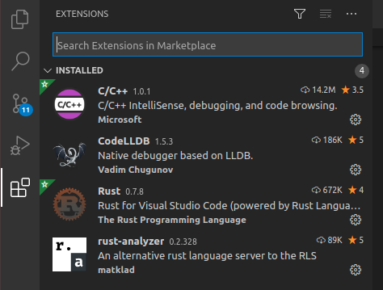
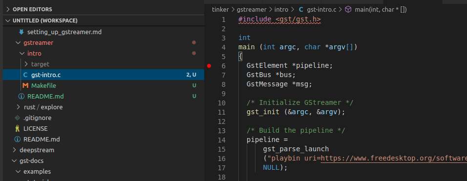
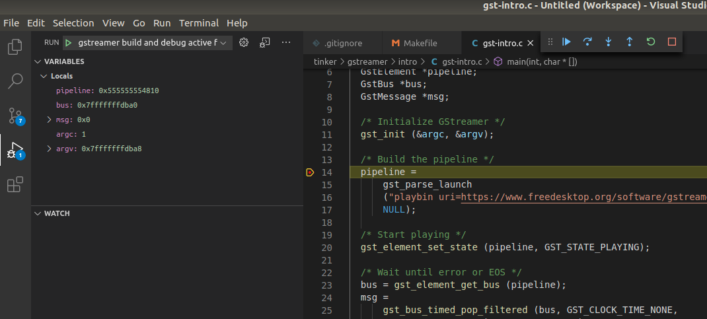

---
testspace:
---

# Setting Up C++ tool chains for GStreamer 

- [Setting Up VS Code](#setting-up-vs-Code)
- [Hello World](#hello-world)


## Setting Up VS Code

First install the C++ Plugin from the MarketPlace 



As we want to debug and build from VS Code we want to setup the environment correctly so we can 
trace through the code (and forgive me my C is beyong rusty)

Install the toolchain

```
$ sudo apt-get install build-essential gdb pkg-config
```

Then I added a task in [.vscode/tasks.json](../.vscode/tasks.json) and a launcher based on [this article](https://code.visualstudio.com/docs/cpp/config-linux). Nothing fancy. 

### Hello World

This is a simple example. However the same process should apply to all the other "mini" projects.

To run the command from the command line

```shell
$ cd gstreamer/intro
$ make run
```

To build and debug, do the following

- select the file (e.g. [gstreamer/intro/gst-intro.c](../../gstreamer/intro/gst-intro.c)) and open it as illustrated below
  
- set a break point
- click on the "debug/Play" Icon on the left handside bar (just above marketplace) and select the
  ``gstreamer build and debug active file`` from the drop down. This will automatically build the file in 
  debug and then launch the debugger and stop on the breakpoint.
  
  
if you run this example you should get something like this


