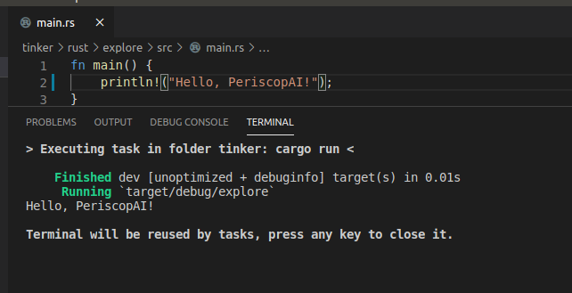
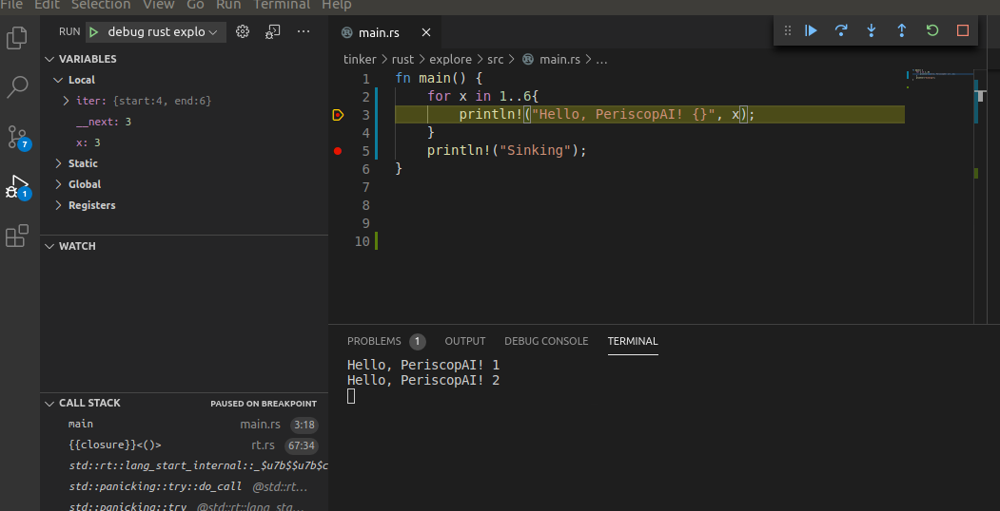

---
testspace:
---

# Setting Up VS Code for Rust

- [VS Code Configuration](#vc-code-configuration)
    - [Required Integrations](#required-integrations)
        - [Rust (Rust Language Server or RLS)](#rust-rust-language-server-or-rls)
        - [Rust Analyzer](#rust-analyzer)
        - [CodeLLDB (Debugger)](#codelldb-debugger)
    - [Configuring the builder](#configuring-the-builder)
    - [Debugging Code](#debugging-code)

---
NOTE

check the [rust installation](../procedures/4_rust/installation.md) chpater for instructions.

---

# VS Code Configuration

The following is based on those two articles:

* [Developing in Rust using Visual Studio Code](https://dev.to/thiagomg/developing-in-rust-using-visual-studio-code-4kkl)

Because Rust support is not built-in VS Code and requires [Custom Task](https://code.visualstudio.com/docs/editor/tasks#_custom-tasks),
but this is most likely about to change since [Microsoft is adopting Rust](https://code.visualstudio.com/docs/editor/tasks#_custom-tasks).
Why? Because Rust has performance of C++ without the memory safety issues of C++ (~70% of security patches are memory related bugs)

# Required Integrations

## Rust (Rust Language Server or RLS)

* [Rust on MarketPlace](https://marketplace.visualstudio.com/items?itemName=rust-lang.rust)

## Rust Analyzer

* [rust-analyzer on MarketPlace](https://marketplace.visualstudio.com/items?itemName=matklad.rust-analyzer)

## CodeLLDB (Debugger)

* [CodeLLDB on MarketPlace](https://marketplace.visualstudio.com/items?itemName=vadimcn.vscode-lldb) from the marketplace.
* [CodeLLDB User Manual](https://github.com/vadimcn/vscode-lldb/blob/v1.5.3/MANUAL.md)

## Configuring the builder

The builder is basically a [custom VS Code Task](https://code.visualstudio.com/docs/editor/tasks#vscode). When you 
install the Rust Integration, it assumes that your Cargo.toml is at the root of the "folder". You can actually modify
it as shown below to build from another directory, preset environment variables, etc. Note that unlike normal 
json, you can actually insert comments (M$ like to break the rules).


```json
{
    // See https://go.microsoft.com/fwlink/?LinkId=733558
    // for the documentation about the tasks.json format
    "version": "2.0.0",
    "tasks": [
        {
            "label": "build rust explore",
            "type": "shell",
            "command": "cargo",
            "args": [
                "run",
                // "--release",
                // "--",
                // "arg1"
            ],
            "group": {
                "kind": "build",
                "isDefault": true
			},
			"options": {
				"cwd": "${workspaceFolder}/rust/explore",
			}
        }
    ]
}
```

So once this is configured, you can invoke the build using ``ctrl-shit-b``



As you can see [here](../.vscode/tasks.json) there is more than one task associated to that package. One to build and one to run. 

By default, ``ctrl-shit-b`` will run the task for which the 
``default`` key is set to ``true``.

You can changed this by selecting ``Terminal`` -> ``Configure Default Build Task ...`` and select the task to be used as default.

If you want to run another build task without setting it as the 
default one, click ``Terminal`` -> ``Run Task``

---

**Tip**

If you want to be able to select which task to run when pressing
``ctrl-shit-b``, then set ``default`` to *false* in which case 
you will always be presented with a picker to select which task
you want to run. 

---

## Debugging Code

Here we assume that the default build task is "build" only (we 
don't want to run if we intend to debug)

So now that we can build stuff, let's debug it. The following is only required to set things up

* Press ``ctrl-shift-p`` and select *Debug: Open launch.json*
* select the workspace from the picker.
* select LLDB from the picker
* This will add a [launch.json](../.vscode/launch.json) file 
  under the [.vscode](../.vscode) which shoould look like this

```json
{
    // Use IntelliSense to learn about possible attributes.
    // Hover to view descriptions of existing attributes.
    // For more information, visit: https://go.microsoft.com/fwlink/?linkid=830387
    "version": "0.2.0",
    "configurations": [
        {
            "type": "lldb",
            "request": "launch",
            "name": "debug rust explore",
            "program": "${workspaceFolder}/rust/explore/target/debug/explore",
            "args": [],
            "cwd": "${workspaceFolder}"
        }
    ]
}
  ```

  Of course, I am assuming that you can define multiple launchers. 

  To start debugging, either press ``F5`` or ``ctrl-shift-d`` and then press the play button. You can toggle breakpoints
  with ``F9``. Everything else is pretty standard stuff and 
  can be found under the ``Run`` menu.

  


