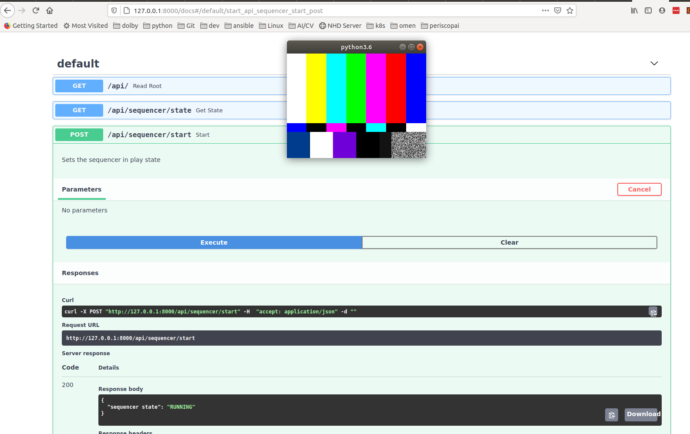

# Prototype

**Table Of Content**

- [Before we start](#before-we-start)
    - [Building the documentation](#building-the-documentation)
    - [Building the Code](#building-the-code)
    - [Testing](#testing)
    - [Running](#running)
    - [CI](#ci)
    - [Documenting the code](#documenting-the-code)

- [Python Extensions](#python-extensions)
  - [PYO3](#pyo3)

- [REST API](#rest-api)

- [Crates](#crates)
    - [lib.rs](#librs)

- [API Documentation](https://periscopai.github.io/tinker/pai_gst_sequencer/index.html)
- Devpi Index: https://m.devpi.net/periscopai/dev


The goal of this prototype is to build the software stack vertically 
to ensure that all layers can be integrated.

```

        +--------------------------+
        |  Rest API     - Python   |
        +--------------------------+
                    |
                    V
        +--------------------------+
        |  Engine       - Python   |
        +--------------------------+
                    |  
                    V
    #=================================#
    #         pai-gst-sequencer       #
    #   +--------------------------+  #
    #   |   AI Sequencer - Rust    |  #
    #   +--------------------------+  #
    #               |                 #
    #               V                 #
    #   +--------------------------+  #
    #   |  AI GST Pipeline  - C    |  #
    #   +--------------------------+  #
    #                                 #
    #=================================#


```

# Before we start

---

**IMPORTANT**

Before checking in, allways run ``make precheck``. This will perform a clean, reformat 
the code, build it, run the tests and build the documentation.
---

Things will be moving pretty fast as we make progress so keep an eye on the documentation.

Make sure to install the dependencies account to the [gstreamer version found on crates.io](https://crates.io/crates/gstreamer#installation-linux)

Also, I recomment that you clone the [gstreamer-rs project](https://github.com/sdroege/gstreamer-rs.git)

```shell
$ gh repo clone sdroege/gstreamer-rs
or 
$ git clone https://github.com/sdroege/gstreamer-rs.git
```
As it contains a few examples we can inspire ourselves from. 

There is a simple [Makefile](Makefile) which has the following targets

```shell
  :prototype|proto/command-line-args⚡ ⇒  make
  Build system for the periscopai proto
  Targets
  -------
  setup   - installs the required dependencies
  build   - builds the code
  run     - builds and runs
  doc     - builds documentation and show the output
  test    - runs the test
  clean   - cleans the build targets
```

First run the ``make install`` target (only needed once) to install the dependencies.


## Building the documentation

```shell
cd prototype
make doc show-doc=yes
```

## Building the code

```shell
cd prototype
make build
```

## Testing

I haven't quite figure out how to write tests. To run them however, type

```shell
:prototype:proto/structure⚡ ⇒  make test      
   Compiling pai-gst-sequencer v0.1.0 (/home/laurent/periscopai/tinker/prototype/pai-gst-sequencer)
    Finished test [unoptimized + debuginfo] target(s) in 0.18s
     Running target/debug/deps/pai_gst_sequencer-0dd1e86d0dee26aa

running 1 test
test tests::it_works ... ok

test result: ok. 1 passed; 0 failed; 0 ignored; 0 measured; 0 filtered out

     Running target/debug/deps/pai_gst_sequencer-e06ef441e97943fa

running 0 tests

test result: ok. 0 passed; 0 failed; 0 ignored; 0 measured; 0 filtered out

   Doc-tests pai-gst-sequencer

running 1 test
test src/lib.rs - PAISequencerState (line 43) ... ok

test result: ok. 1 passed; 0 failed; 0 ignored; 0 measured; 0 filtered out
```

If will automatically run the doctest, that is try to execute the code specified
in a markdown code section. If not specified, it assumes **Rust**. So if you don't 
want to run say an ascii graphic and get an error make sure to mark it as ``text``

check [prototype/pai-gst-sequencer/src/lib.rs](pai-gst-sequencer/src/lib.rs#10) for
an example.

Therefore you need to make sure the examples can run, for instance, this would fail

```rust
println!("sequencer state '{:?}'",sequencer.get_state());
```
whereas this would work
```rust
use pai_gst_sequencer::*;
let mut sequencer = PAISequencer::new("video");
println!("sequencer state '{:?}'",sequencer.get_state());
```
but if you want to hide the first to line from the final documentation
```rust
# use pai_gst_sequencer::*;
# let mut sequencer = PAISequencer::new("video");
println!("sequencer state '{:?}'",sequencer.get_state());
```
The statement preceeded with ``# `` will run but be hidden from the final 
documentation. 


## Running 

```
cd prototype
make run
```

## CI

There are two gitlab workflows

- [.github/workflows/rust-proto-sequencer-build.yml](../../.github/workflows/rust-proto-sequencer-build.yml) drive the 
CI upon check ins and merge requests. 
  - [Testspace GitHub Action](https://github.com/testspace-com/setup-testspace) for testspace integration.


- [.github/workflows/rust-proto-sequencer-doc.yml](../../.github/workflows/rust-proto-sequencer-doc.yml) publishes 
  documentation on merge requests. The document is available at https://periscopai.github.io/tinker/pai_gst_sequencer.
  We are currently building with all dependencies so that we can peruse through dependency documentaiton as well. 
  - [Rust Toolchain Action](https://github.com/actions-rs/toolchain) for installing the nightly toolchain.
  - [GitHub IO Pages Action](https://github.com/peaceiris/actions-gh-pages) to publish our doc on GitHub Pages.


## Documenting the code

Check the [Rust Documentation section](../doc/rust_primer.md#Documenting-the-code)

# Python Extensions

We want to create an extension providing access from Python to the sequencer. From various readings, there 
are two methods. 

- [cpython-rust](https://docs.rs/cpython/0.5.1/cpython/) available on [crates.io](https://crates.io/crates/cpython) which 
  currently has about 200K downloads. Here is an [article on the subject](https://codeburst.io/how-to-use-rust-to-extend-python-360174ee5819).  
- [pyo3](https://pyo3.rs) available on [crates.io](https://crates.io/crates/pyo3), has roughly twice the downloads and 
   appears to have better support. In fact Pyo3 appears to be a fork from cpython-rust. I also came across
   the topic on the [Why would a python programmer learn rust when there are no jobs in it](https://youtu.be/IYLf8lUqR40?t=974)  
   at the Debian Conference (2019)

Now, from what I understand, pyo3 only work with rust nighly, however, pyo3 seems a lot more trivial than cpython-rust. 
So for the purpose of this prototype, I suggest we start with pyo3.

In either case, you will need to make you crate a dynamic library


## Pyo3

[Here](https://depth-first.com/articles/2020/08/10/python-extensions-in-pure-rust-with-pyo3/) is another, perhaps more comprehensive article.

---
**RUNNING THIS STUFF OUT OF THE BOX**

```
:prototype|proto/python-bindings⚡ ⇒ make setup # This create a venv under ~/venv/periscopai
...
******************** RUN THE FOLLOWING COMMAND ********************
source ~/venv/periscopai/bin/activate
*******************************************************************
:prototype|proto/python-bindings⚡ ⇒ source ~/venv/periscopai/bin/activate
(periscopai):prototype|proto/python-bindings⚡ ⇒  make pytest
~/venv/periscopai/bin/maturin develop -b pyo3 --manifest-path pai-gst-sequencer/Cargo.toml
🐍 Found CPython 3.6m at python
   Compiling proc-macro2 v1.0.24
   Compiling unicode-xid v0.2.1
   Compiling syn v1.0.46
...
   Compiling pai-gst-sequencer v0.1.0 (/home/laurent/periscopai/tinker/prototype/pai-gst-sequencer)
    Finished dev [unoptimized + debuginfo] target(s) in 30.65s
~/venv/periscopai/bin/pytest pytests --junit-xml=results.xml 
=========================== test session starts ================================================
platform linux -- Python 3.6.9, pytest-6.1.1, py-1.9.0, pluggy-0.13.1
rootdir: /home/laurent/periscopai/tinker/prototype
collected 1 item                                                                                                                                                             

pytests/test_basic.py .                                                                                                                                                [100%]

--------- generated xml file: /home/laurent/periscopai/tinker/prototype/results.xml -------------
======================================== 1 passed in 5.04s ======================================

```
---

Configuring the [cargo.toml](pai-gst-sequencer/Cargo.toml) file. Note the following

```toml
[lib]
name = "pai_gst_sequencer"
crate-type = ["cdylib", "lib"]
```

PYO3 requires ``cdylib`` which generates a dynamic that needs to be loaded from 
other languages. 

Also you want to set your rust toolchain to ``nightly``

```shell
rustup default nightly
```


```shell
:pai-gst-sequencer|proto/python-bindings⚡ ⇒  cargo run
   Compiling pai-gst-sequencer v0.1.0 (/home/laurent/periscopai/tinker/prototype/pai-gst-sequencer)
error[E0432]: unresolved import `pai_gst_sequencer`
 --> src/main.rs:6:5
  |
6 | use pai_gst_sequencer::*;
  |     ^^^^^^^^^^^^^^^^^ use of undeclared type or module `pai_gst_sequencer`

error[E0433]: failed to resolve: use of undeclared type or module `PAISequencer`
  --> src/main.rs:59:25
   |
59 |     let mut sequencer = PAISequencer::new(&input);
   |                         ^^^^^^^^^^^^ use of undeclared type or module `PAISequencer`

error[E0433]: failed to resolve: use of undeclared type or module `PAISequencerState`
  --> src/main.rs:65:41
   |
65 |     assert!(matches!(sequencer.state(), PAISequencerState::RUNNING));
   |                                         ^^^^^^^^^^^^^^^^^ use of undeclared type or module `PAISequencerState`

error[E0433]: failed to resolve: use of undeclared type or module `PAISequencerState`
  --> src/main.rs:82:41
   |
82 |     assert!(matches!(sequencer.state(), PAISequencerState::STOPPED));
   |                                         ^^^^^^^^^^^^^^^^^ use of undeclared type or module `PAISequencerState`

error: aborting due to 4 previous errors

Some errors have detailed explanations: E0432, E0433.
For more information about an error, try `rustc --explain E0432`.
error: could not compile `pai-gst-sequencer`.
```

Fortunately, the [crate type are stackable](https://doc.rust-lang.org/reference/linkage.html)
which means that we can generate a library (``lib``) which will be linked with the 
[application](pai-gst-sequencer/src/main.rs). This is somewhat documented in the 
[cargo issue 6659](https://github.com/rust-lang/cargo/issues/6659).

---

**KNOWN PROBLEMS**

- Currently, I can't build the application. It fails with a linker error. So basically  
  only python works. Now if I comment out all the "pyo3" macros, all is fine. 
- I could not figure out how to "export" enums to python so I basically declared some 
  contants as static class member.
---

# REST API
 
 Implemented a small [FastAPI](https://fastapi.tiangolo.com/) server to control 
 the sequencer. 

 To start the server

 ```shell
 (periscopai):prototype|proto/python-bindings⚡ ⇒  make server
~/venv/periscopai/bin/maturin develop -b pyo3 --manifest-path pai-gst-sequencer/Cargo.toml
🐍 Found CPython 3.6m at python
    Finished dev [unoptimized + debuginfo] target(s) in 0.03s
firefox http://127.0.0.1:8000/docs
python3.6 backend/main.py
INFO:     Uvicorn running on http://127.0.0.1:8000 (Press CTRL+C to quit)
INFO:     Started reloader process [3260] using statreload
INFO:     Started server process [3264]
INFO:     Waiting for application startup.
INFO:     Application startup complete.
 ```

 To view the API documentation goto http://127.0.0.1:8000/docs

 

 Of you can also play with Curl

 ```shell
 (periscopai):prototype|proto/python-bindings⚡ ⇒  curl -X GET "http://127.0.0.1:8000/api/sequencer/state" -H  "accept: application/json"                                                                                   
{"sequencer state":"CREATED"}%                                                                                     
(periscopai):prototype|proto/python-bindings⚡ ⇒  curl -X POST "http://127.0.0.1:8000/api/sequencer/start" -H  "accept: application/json" -d ""   
{"sequencer state":"RUNNING"}%                                                                                     
(periscopai):prototype|proto/python-bindings⚡ ⇒  curl -X POST "http://127.0.0.1:8000/api/sequencer/stop" -H  "accept: application/json" -d ""    
{"sequencer state":"STOPPED"}%                                                                                     
(periscopai):prototype|proto/python-bindings⚡ ⇒  curl -X GET "http://127.0.0.1:8000/api/sequencer/state" -H  "accept: application/json"
{"sequencer state":"STOPPED"}%        
 ```

# React Frontend code

I have started building a small React application. For more information see
[frontend/README](frontend/README.md)

# Crates

---

**Tip**
Remember a crate in Rust is the same as a python module, that it a file in a 
package which contains a *cargo.toml* instead of an *__init__.py*

---


- [prototype/pai-gst-sequencer/src/lib.rs](pai-gst-sequencer/src/lib.rs)
  This is the library which can be access via ``use pai_gst_sequencer::*``

- [prototype/pai-gst-sequencer/src/main.rs](pai-gst-sequencer/src/main.rs)
  this is the binary crate. Basically when building the crate, it will also create 
  a binary which can be executed. 

---

**Todo's**

- Figure out how to make a constructor.
- Understand how an assertion on enum is so convoluted (see the main.rs file)
- figure out how to write some test

---


- [AI Pipeline] 


[AI Pipeline]: ./pai-gst-sequencer
