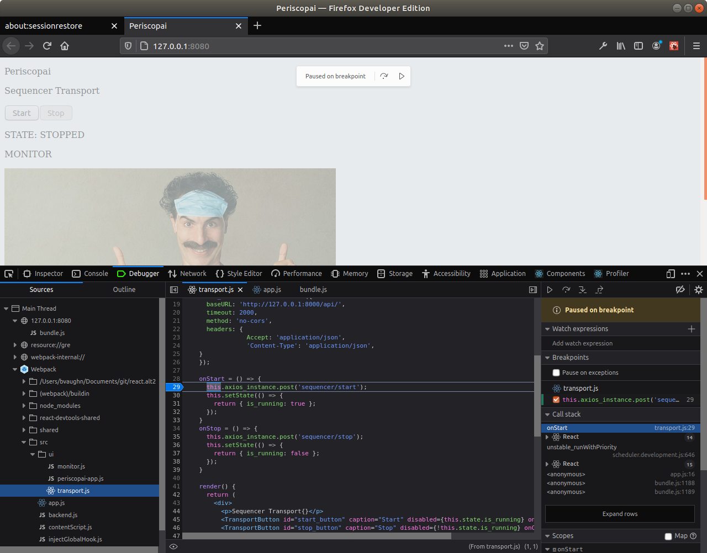

# Installation

Add the following ``export PATH=$PATH:$HOME/.yarn/bin/`` to your .zshrc or .bashrc

```shell
...
export PATH=$HOME/.cargo/bin/:$PATH
export PATH=$PATH:$HOME/.yarn/bin/

if command -v pyenv 1>/dev/null 2>&1; then
...
```

when running for the first time, run

```shell
$ make setup
```

This will install nodejs, yarn and all the required dependencies.

Next time around, simply install using

```shell
$ make install
```

Finally to run the code, type
```shell
$ make run [webpack=periscopai|pakt]
```

This will launch the webpack server according to the configuration found in [webpack.config.js](webpack.config.js).
``periscopai``, which is the name of the configuration, points to the lame application we have at this point,
whereas ``pakt`` is point to ``apps.js`` in a scratch folder which can be use to tinker with things. 

Now webpack does a lot of things behind the scene including creating a bundle.js file in memory which is 
preprocessed by Babel (see the **old way** below) prior to being served. Because the code generated by 
devpack is almost impossible to comprehend, the ``devtool: 'eval-cheap-module-source-map'`` is added 
to the webpack configuration which enables you to debug your own code rather than the bundle.  

---
**Old way**

*This is how the server was launched in the past - just for reference. Now we are using webpack*

This will invoke Babel to cross compile ``path_to_the_source_js`` to [public/scripts/app.js](public/scripts/app.js).
Note that you DO NOT WANT to edit this file as it is automatically generated from the source ``path_to_the_source_js``.
By default, source point to [src/app.js](src/app.js)

``make run`` will also start the live server which automatically load the code in your default browser. 
Whenever the file is saved, it is cross-compiled, then reloaded to the browser.

Simply ``CTRL-C`` make to stop this process.
---


---
**NOTE**

when starting ``live-server public``, if you see ``ERROR: Error: ENOSPC: System limit for number of file watchers reached, watch 'public'``
to increase the number of file watches which is most likely to reload files on the fly when they change

```
# insert the new value into the system config
echo fs.inotify.max_user_watches=524288 | sudo tee -a /etc/sysctl.conf && sudo sysctl -p

# check that the new value was applied
cat /proc/sys/fs/inotify/max_user_watches

# config variable name (not runnable)
fs.inotify.max_user_watches=524288

```
---


# The code

The code is located under the [public](public) folder. I have documented most of it in the code 
itself.

There is a single [public/index.html](public/index.html) which loads the bundle.js file. 
This file is autogenerated and we should not check it in. 

The application code is located under the [src](./src) folder. The main entry point is [src/app.js](src/app.js).
When starting the webpack server, this code is transcoded to ES5 compatible code. 

# running the server

goto [prototype/frontend](.) and type ``make run``

```shell
:frontend|proto/react-frontend⚡ ⇒  make run webpack=periscopai
webpack server for 'periscopai' configuration
webpack serve --config-name=periscopai
ℹ ｢wds｣: Project is running at http://localhost:8080/
ℹ ｢wds｣: webpack output is served from undefined
ℹ ｢wds｣: Content not from webpack is served from /home/laurent/periscopai/tinker/prototype/frontend/public
ℹ ｢wdm｣: asset bundle.js 3.54 MiB [emitted] (name: main)
runtime modules 430 bytes 3 modules
modules by path ./node_modules/ 1.32 MiB 57 modules
modules by path ./src/ 11.5 KiB
  ./src/app.js 1.27 KiB [built] [code generated]
  ./src/ui/periscopai-app.js 2.79 KiB [built] [code generated]
  ./src/ui/transport.js 4.91 KiB [built] [code generated]
  ./src/ui/monitor.js 2.56 KiB [built] [code generated]
periscopai (webpack 5.4.0) compiled successfully in 826 ms
ℹ ｢wdm｣: Compiled successfully.
```

open the browser at http://127.0.0.1:8080/
# Debugging the code

There are some vscode extension to enable your to debug your code from vscode but 
I couldn't figure them out and got impatient. The [firefox developer edition](https://www.mozilla.org/en-US/firefox/developer/) 
(not the regular one) has a really good set of tools as illustrated below. 



When the webpack server is running, any changes made in VSCode is automatically reloaded and reflected in the 
debugger. 

To install firefox developer edition, simply download the tarball from the site, extract it somewhere and created an alias to 
the executable (e.g. ``alias firefox-dev=~/temp/firefox/firefox``)

The start firefox

```shell
:firefox|⇒  firefox-dev http://127.0.0.1:8080 
```