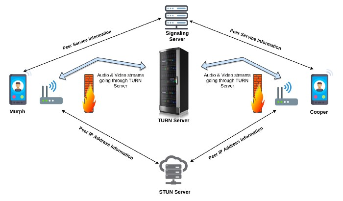

# WebRTC

[WebRTC](https://en.wikipedia.org/wiki/WebRTC) is a "standard" for real 
time communication (not limited to video conferencing) aimed at 
establishing sessions for real time communication between one or more 
entities. 

There are multiples possible topologies which also involve different 
services depending on their complexity. Keep in mind that WebRTC is 
intended to connect entities which may sit behing NAT or are constrained
by very strict firewall rules. While we do not intend to use most of 
those services, it is important to understand what they are:

- **ICE** or [Interactive Connectivity Establishment ](https://en.wikipedia.org/wiki/Interactive_Connectivity_Establishment)
  is a framework to find and establish connection with peers via a STUN server. 
  This will not be needed because we can only connect with one peer, the periscopai pipeline 
  running on the same host. 

- **STUN** or [Session Traversal Utilities for NAT](https://en.wikipedia.org/wiki/STUN) is a 
  protocol to discover the public IP + port of a peer sitting behind NAT. 
  As for the ICE, we are assuming that a STUN server is not needed as we assume that the client 
  is on the same local network. 

- **TURN** or [Traversal Using Relays Around NAT](https://webrtc.org/getting-started/turn-server) is 
  an even more exotic concept in the event that firewall rules prevents direct connection between 
  peer. The Server acts as a proxy for each connected peer, where one subscriber posts data to the 
  TURN and the others can fetch it (hence the term relay). This is of course, also something we 
  do not need to be pre-occupied with (at least for now).

This is illustrated below. 

However, an important concept is the SDP. 

- **SDP** or [Session Description Protocol](https://en.wikipedia.org/wiki/Session_Description_Protocol)
  is a very important concept. The SDP is basically the protocol by which two 
  peers can discover their capabilities and intent. This describes the codecs, 
  encryption, etc. that is expected from the session. 

I came accross this project [webrtc-without-signaling-server](https://github.com/lesmana/webrtc-without-signaling-server)
which is very similar to what we need to achieve. This was also part of an experiment for some gaming  app.

# The Prototype

There are two aspect to this. First we need to implement the javascript to establish 
a video connection with the backend (gstreamer). For now we are limiting ourselves to 
video only but we could eventually consider capturing audio as well. 

Note that most of the "sample" I find out there don't work out of the box. So basically it 
boils down to reading multiple samples and trying to make sense of them. 

# References

* [MDN Protcols](https://developer.mozilla.org/en-US/docs/Web/API/WebRTC_API/Protocols)
* [What is WebRTC (medium.com)](https://medium.com/av-transcode/what-is-webrtc-and-how-to-setup-stun-turn-server-for-webrtc-communication-63314728b9d0)